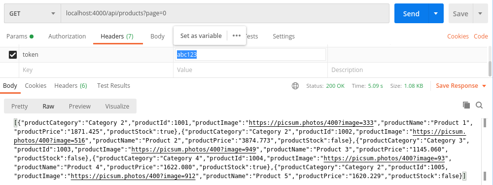

# Projeto

Este projeto faz parte do desafio proposto pelo [getmorebrazil](https://github.com/getmorebrasil/getmore-api-challenge).

## Como iniciar

### Docker compose

Primeiro é necessário rodar o docker compose para subir o postgres e o RabbitMQ.

```
docker-compose up
```

### Auth

Após o docker compose subir complematmente, é necessário iniciar o sistema de autenticação (Auth)

```
cd auth

mix deps.get

iex -S mix run

cd ..
```

### Products

Após o sistema Auth subir complematmente, é necessário subir o sistema products

```
cd products

mix deps.get

mix ecto.migrate

iex -S mix phx.server

cd ..
```

## Usando o sistema

Após todos os sistemas terem subidos, já será possível utilizar todas as APIs.

### Cadastro de produto

Para cadastrar um único produto:

A requisição será usando o vergo HTTP "POST" para a url "localhost:4000/api/product" passando no corpo um produto:

```
{
    "productId": 1185,
    "productCategory": "Category 4",
    "productName": "Product 185",
    "productImage": "https://picsum.photos/400?image=215",
    "productStock": true,
    "productPrice": "3271.853"
}
```

### Cadastro de produtos

Para cadastrar vários produtos:

A requisição será usando o vergo HTTP "POST" para a url "localhost:4000/api/products" passando no corpo um produto:

```
[
    {
        "productId": 1001,
        "productCategory": "Category 2",
        "productName": "Product 1",
        "productImage": "https://picsum.photos/400?image=333",
        "productStock": true,
        "productPrice": "1871.425"
    },
    {
        "productId": 1002,
        "productCategory": "Category 2",
        "productName": "Product 2",
        "productImage": "https://picsum.photos/400?image=516",
        "productStock": false,
        "productPrice": "3874.773"
    },
    {
        "productId": 1003,
        "productCategory": "Category 3",
        "productName": "Product 3",
        "productImage": "https://picsum.photos/400?image=949",
        "productStock": false,
        "productPrice": "1145.060"
    },
    
    ...

]
```

### Listagem de produtos

Para a listagem de vários produtos através de paginação e autenticação:

A requisição será usando o vergo HTTP "GET" para a url "localhost:4000/api/products?page=0" (aonde o número após o "page=" será a página escolhida), e passando também no Header da requisição um um token com o nome da chaves sendo "token" e o valor sendo "abc123", ficando "token: abc123".

Neste caso se for passado um token inválido você não consseguirá ver os produtos.


