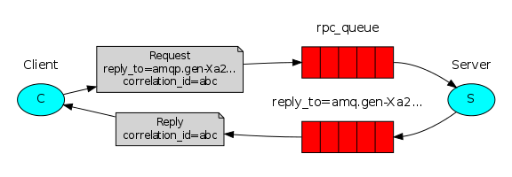

# Marketplace

**Sistema de listagem de produtos**

## Sobre o projeto

O sistema foi criado com RPC:


> O Remote Procedure Call (Chamada de Procedimento Remoto) é uma tecnologia para a criação de programas distribuídos servidor/cliente que provê um paradigma de comunicação de alto nível no sistema operacional, já presumindo a existência de um protocolo de transporte, como TCP/IP ou UDP, para carregar a mensagem entre os programas comunicantes.
> Assim, o usuário pode utilizar procedimentos remotos como se fossem chamadas locais, sem precisar se preocupar com possíveis diferenças, tal como a arquitetura, da máquina do processo cliente e do servidor.

Foi o sistema foi separado em 4 serviços cliente, marketplace, messageria e banco de dados:

- 1°) serviço de cliente: Funciona como uma api que vai receber os parametros de busca e repassar para o serviço de messageria.

- 2°) serviço de marketplace: É o serviço responsavel por realizar o processamento dos dados, retornando os produtos paginados ao receber uma requisição pelo serviço de messageria.

- 3°) Serviço de messageria: Foi utilizado o rabbitMQ, para gerenciar a comunicação entre os serviços de client e server.

- 4°) Serviço de banco de dados: Foi utilizado o postgresDB, para armazenar os dados dos produtos.

## Construído com

Foram utilizadas as respectivas tecnologias:

- Serviço client: [Nodejs](https://nodejs.org/en/)
- Serviço marketplace: [Elixir](https://elixir-lang.org/)
- Serviço messageria: [RabbitMQ](https://www.rabbitmq.com/)
- Serviço de banco de dados: [Postgres](https://www.postgresql.org/)
- Gerenciador de conteiners: [Docker](https://www.docker.com/)

## Getting Started

### Pré-requisitos

Ter o docker e docker-compose instalados:

- [Docker](https://www.docker.com/get-started)
- [Docker-Compose](https://docs.docker.com/compose/install/)

### Instalação

Rodar o comando de build do docker compose:

```
docker-compose build
```

### Iniciar aplicação

1 - Rodar o comando de start do docker-compose:

```
docker-compose up
```

2 - Acessar o container do marketplace server:

```
docker exec -it <id-container-do-marketplace-server> bash
```

3- Popular o banco de dados:

```
mix run priv/repo/seeds.exs
```

## Contato

João Henrique Gomes

Email: joaoh3326@gmail.com

github: https://github.com/Joaoh3326
