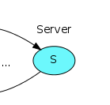

# Marketplace

**Sistema de listagem de produtos**

## Sobre o projeto

É serviço responsavel pelo processamento dos dados, retornando os produtos paginados ao receber uma requisição pelo serviço de messageria.

## Construído com

Foram utilizadas as respectivas tecnologias:

- Serviço marketplace: [Elixir](https://elixir-lang.org/)
- Serviço messageria: [RabbitMQ](https://www.rabbitmq.com/)
- Serviço de banco de dados: [Postgres](https://www.postgresql.org/)
- Gerenciador de conteiners: [Docker](https://www.docker.com/)

## Contato

João Henrique Gomes

Email: joaoh3326@gmail.com

github: https://github.com/Joaoh3326
