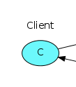

# Marketplace

**Sistema de listagem de produtos**

## Sobre o projeto

Funciona como uma api que vai receber os parametros de busca e repassar para o serviço de messageria.

## Construído com

Foram utilizadas as respectivas tecnologias:

- Serviço client: [Nodejs](https://nodejs.org/en/)
- Serviço messageria: [RabbitMQ](https://www.rabbitmq.com/)
- Gerenciador de conteiners: [Docker](https://www.docker.com/)

## Contato

João Henrique Gomes

Email: joaoh3326@gmail.com

github: https://github.com/Joaoh3326
